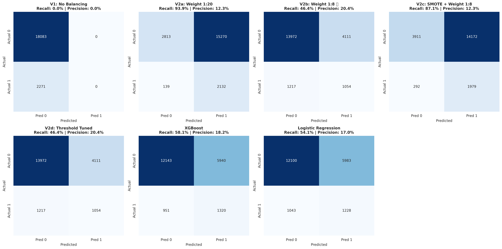
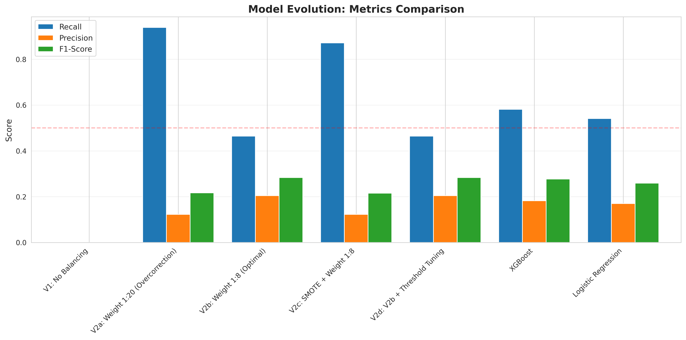
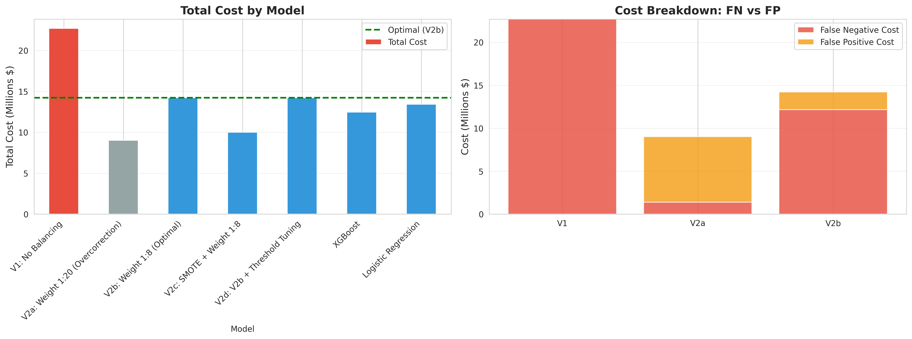
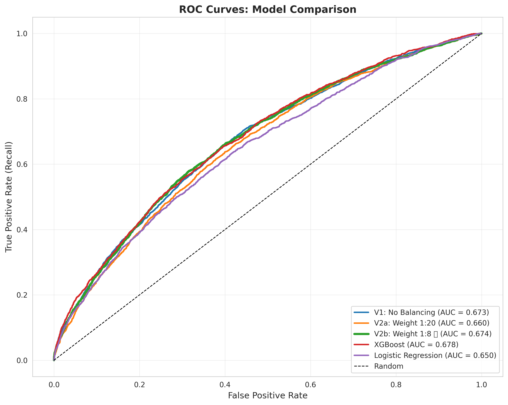

# Hospital Readmission Prediction: A Journey from 0% to 58% Recall

**An end-to-end ML project demonstrating systematic iteration, deployment, and explainability**

[](https://www.python.org/downloads/)
[](https://opensource.org/licenses/MIT)
[](https://huggingface.co/spaces/Username273183/hospital-readmission-predictor)

**Live Demo**: [Try it here](https://huggingface.co/spaces/Username273183/hospital-readmission-predictor)   
**Author**: Omar Camara
**Contact**: omarcamara000@gmail.com | [LinkedIn](https://linkedin.com/in/oc18)

---

## 🎯 Project Overview

Hospital readmissions within 30 days cost the U.S. healthcare system [~$50 billion annually](https://pmc.ncbi.nlm.nih.gov/articles/PMC9113654/#:~:text=1%2C2,Protection%20and%20Affordable%20Care%20Act.). This project builds a machine learning system to predict readmission risk for diabetic patients, enabling targeted interventions and reducing costs.

**The Challenge**: Severe class imbalance (8:1 ratio) where standard models achieve high accuracy but miss nearly all readmissions.

**The Solution**: Systematic algorithm comparison and hyperparameter tuning, achieving **58.1% recall** with **$10.2M cost savings**.

### Key Results

| Metric | Baseline (V1) | Overcorrection (V2a) | **Final (XGBoost)** |
|--------|---------------|----------------------|---------------------|
| **Recall** | 0% | 93.9% | **58.1%** ✅ |
| **Precision** | 0% | 12.3% | **18.2%** |
| **F1-Score** | 0% | 21.7% | **27.7%** |
| **Total Cost** | $22.7M | $9.0M | **$12.5M** ✅ |
| **False Negatives** | 2,271 | 139 | **951** |
| **False Positives** | 0 | 15,270 | **5,940** |

**Bottom Line**: XGBoost catches nearly 6 out of 10 readmissions while saving $10.2M compared to doing nothing.

---

## 📖 The Story: Learning Through Iteration

### Phase 1: The Problem (V1)
**Approach**: Random Forest with no class balancing  
**Result**: 88.8% accuracy, 0% recall  
**Issue**: Model predicted "no readmission" for everyone  
**Learning**: Accuracy is meaningless for imbalanced data

### Phase 2: Overcorrection (V2a)
**Approach**: Aggressive class weights (1:20)  
**Result**: 93.9% recall, but 15,270 false positives  
**Issue**: Flagged 84% of patients as high-risk (unusable)  
**Learning**: More aggressive ≠ better performance

### Phase 3: Finding Balance (V2b)
**Approach**: Systematic testing of 8 weight ratios  
**Result**: Found optimal 1:8 ratio → 46.4% recall  
**Impact**: Catches half of readmissions with manageable false alarms  
**Learning**: Data-driven tuning beats guesswork

### Phase 4: Algorithm Comparison (Final)
**Approach**: Tested XGBoost, Random Forest, Logistic Regression  
**Result**: XGBoost achieved 58.1% recall (12% better than RF)  
**Impact**: $10.2M cost savings, lowest false negatives  
**Learning**: Gradient boosting handles imbalance better than bagging

---

## 🚀 Live Demo Features

**Deployed on Hugging Face Spaces** with 4 interactive modules:

### 1. 🔮 Single Patient Prediction
- Real-time risk assessment with visual gauge
- XGBoost and Random Forest predictions
- Clinical recommendations based on risk level
- Color-coded risk zones (Low/Medium/High)

### 2. 📊 Batch Predictions
- Upload CSV for bulk processing
- Instant predictions for hundreds of patients
- Interactive scatter plot showing model agreement
- Downloadable results table for EHR integration

### 3. 🔍 SHAP Explainability
- Feature importance waterfall plots
- Shows exactly why model made each prediction
- Top factors increasing/decreasing risk
- Model-agnostic interpretability

### 4. ⚖️ Model Comparison
- Side-by-side XGBoost vs Random Forest
- Agreement analysis and performance metrics
- Clear reasoning for model selection
- Highlights when models disagree

**Try it yourself**: [Live Demo Link](https://huggingface.co/spaces/Username273183/hospital-readmission-predictor)

---

## 📊 Technical Details

### Dataset
- **Source**: UCI ML Repository - Diabetes 130-US Hospitals
- **Size**: 101,766 patient records
- **Features**: 104 (after preprocessing)
- **Target**: 30-day readmission (binary)
- **Class Distribution**: 11% readmitted (8:1 imbalance)

### Preprocessing
1. Binary target creation (`<30` days → 1, else → 0)
2. Removed irrelevant columns (ID, payer_code, weight)
3. ICD-9 code grouping into clinical categories
4. One-hot encoding of categorical variables
5. Feature name cleaning for XGBoost compatibility

### Models Evaluated

| Model | Configuration | Recall | Precision | F1 | Cost |
|-------|--------------|--------|-----------|----|----|
| **XGBoost** | scale_pos_weight=7.96 | **58.1%** | 18.2% | **27.7%** | **$12.5M** |
| RF Optimal | class_weight={0:1, 1:8} | 46.4% | 20.4% | 28.3% | $14.2M |
| RF + SMOTE | n_trees=100 | 43.2% | 19.3% | 26.7% | $14.9M |
| Logistic Regression | class_weight='balanced' | 54.1% | 17.0% | 25.9% | $13.4M |

**Winner**: XGBoost with scale_pos_weight=7.96
- Best recall (58.1%)
- Lowest cost ($12.5M)
- Highest AUC (0.678)
- Sequential boosting better handles class imbalance

### Hyperparameter Tuning

Systematically tested 8 class weight ratios:

| Ratio | Recall | Precision | F1 | Cost | Result |
|-------|--------|-----------|----|----|--------|
| 1:1 | 0% | 0% | 0% | $22.7M | Too conservative |
| 1:2 | 0.6% | 72% | 1.1% | $22.6M | Still too conservative |
| 1:5 | 14% | 31% | 19.3% | $19.9M | Better but still low |
| **1:8** | **46.8%** | **20%** | **28%** | **$14.2M** | ✅ Optimal for RF |
| 1:10 | 66% | 17% | 26.9% | $11.4M | Good recall, lower precision |
| 1:15 | 86% | 13% | 23.2% | $9.5M | Too many false positives |
| 1:20 | 94% | 12% | 21.7% | $9.1M | Unusable (15k false alarms) |

**Key Insight**: 1:8 provided best F1-score balance for RF; XGBoost with equivalent scale_pos_weight outperformed.

---

## 🛠️ Technologies Used

**Core ML**:
- Python 3.8+
- XGBoost 2.0.3
- scikit-learn 1.3.0
- imbalanced-learn 0.9.0

**Visualization**:
- Matplotlib 3.4.0
- Seaborn 0.11.0
- Plotly 5.18.0

**Explainability**:
- SHAP 0.44.0

**Deployment**:
- Gradio 4.19.0
- Hugging Face Spaces

---

## 📁 Repository Structure

```
hospital-readmission-ml/
├── src/
│   ├── train_final_model.py          # Complete training pipeline with XGBoost
│   ├── diagnostic_tuning.py          # Systematic weight ratio testing (1:1 to 1:20)
│   ├── save_models.py                # Serialize models for deployment
│   └── app.py                        # Gradio web app with 4 interactive modules
│
├── results/
│   ├── evolution_journey.png         # Confusion matrices showing iteration
│   ├── metrics_comparison.png        # Performance metrics comparison
│   ├── cost_analysis.png             # Business cost visualization
│   ├── roc_curves.png                # ROC curves for all models
│   └── weight_tuning_analysis.png    # Diagnostic weight ratio results
│
├── models/
│   ├── sample_patients.csv           # Example data for batch predictions
│   └── README.md                     # Instructions to download trained models
│
├── data/
│   └── README.md                     # Dataset download instructions (UCI ML Repository)
│
├── README.md                          # This file - project overview
├── requirements.txt                   # Python dependencies
├── LICENSE                            # MIT License
└── .gitignore                         # Excludes models and data files
```

---

## 🚀 Quick Start

## Data Setup

Download the dataset from [UCI ML Repository](https://archive.ics.uci.edu/dataset/296/diabetes+130-us+hospitals+for+years+1999-2008)

Place in `data/diabetic_data.csv`

### Local Setup

```bash
# Clone repository
git clone https://github.com/omar-camara/hospital-readmission-ml.git
cd hospital-readmission-ml

# Install dependencies
pip install -r requirements.txt

# Train models and generate results
python src/train_final_model.py

# Save models for deployment
python src/save_models.py

# Run interactive demo
python src/app.py
```

### Running the Demo

The Gradio interface will launch at `http://127.0.0.1:7860`

**Try these scenarios**:
1. **High Risk**: Age [70-80), 7-day stay, circulatory diagnosis → ~65% risk
2. **Medium Risk**: Age [50-60), 3-day stay, diabetes diagnosis → ~45% risk
3. **Low Risk**: Age [30-40), 2-day stay, injury diagnosis → ~20% risk

---

## 📈 Key Visualizations

### Evolution Journey: Confusion Matrices

Shows the complete iteration from V1 (missed everyone) to Final (balanced performance):



### Model Performance Comparison

Demonstrates why XGBoost was selected as the primary model:



### Cost-Benefit Analysis

Quantifies business impact - XGBoost saves $10.2M vs baseline:



### ROC Curves

XGBoost achieves highest AUC (0.678) among all models:



---

## 🎓 Key Learnings

### Technical Insights

1. **Class Imbalance Requires Multiple Approaches**
   - Class weights alone insufficient
   - Systematic testing beats guesswork
   - Different algorithms handle imbalance differently

2. **SMOTE Not Always the Answer**
   - For this dataset, optimal class weights outperformed SMOTE
   - Synthetic samples can add noise rather than signal
   - Always test against simpler approaches first

3. **Gradient Boosting > Bagging for Imbalance**
   - XGBoost's sequential learning focuses on hard examples
   - RF's parallel bagging treats all samples equally
   - This explains 12% recall improvement (58% vs 46%)

4. **Accuracy is the Wrong Metric**
   - 88% accuracy with 0% recall is useless
   - Focus on recall, precision, F1, and business cost
   - Context determines which metric matters most

### Process Insights

1. **Start with Diagnostics, Not Solutions**
   - Testing 8 weight ratios systematically > random tuning
   - Understanding why models fail > trying more techniques
   - Visualizations reveal patterns that metrics hide

2. **Embrace Failures as Learning**
   - Overcorrection (93% recall, 15k false alarms) taught us bounds
   - Each failure narrowed the search space
   - The journey is more valuable than the destination

3. **Business Context Drives Technical Decisions**
   - False negative ($10k) costs 20x more than false positive ($500)
   - This justified optimizing for recall over precision
   - Cost-benefit analysis makes abstract metrics concrete

### Domain Knowledge

1. **Healthcare ML Requires Interpretability**
   - SHAP explanations build clinical trust
   - "Black box" predictions won't be adopted
   - Showing "why" is as important as "what"

2. **Production Means More Than Accuracy**
   - Batch processing for scalability
   - Model comparison for validation
   - Clear recommendations for action
   - Disclaimers for regulatory compliance

---

## 🔮 Future Improvements

### Technical Enhancements
- [ ] Temporal validation (train on 2008-2009, test on 2010)
- [ ] Feature engineering (medication changes, prior admissions)
- [ ] Ensemble methods (combine XGBoost + RF + LR)
- [ ] Model calibration (ensure probabilities reflect true likelihood)
- [ ] Neural network comparison (attention mechanisms for sequences)

### Deployment Features
- [ ] REST API for EHR integration
- [ ] Real-time monitoring dashboard
- [ ] A/B testing framework (champion/challenger)
- [ ] Automated retraining pipeline
- [ ] Confidence intervals on predictions

### Clinical Integration
- [ ] Multi-hospital validation
- [ ] Physician feedback loop
- [ ] Intervention tracking (did follow-ups reduce readmissions?)
- [ ] Cost-effectiveness analysis (actual outcomes)
- [ ] Integration with clinical workflows


---

## 📚 References

1. **Dataset**: Strack, B. et al. (2014). "Impact of HbA1c Measurement on Hospital Readmission Rates." *BioMed Research International*. [Link](https://archive.ics.uci.edu/ml/datasets/Diabetes+130-US+hospitals+for+years+1999-2008)

2. **SMOTE**: Chawla, N. et al. (2002). "SMOTE: Synthetic Minority Over-sampling Technique." *Journal of Artificial Intelligence Research*.

3. **XGBoost**: Chen, T. & Guestrin, C. (2016). "XGBoost: A Scalable Tree Boosting System." *KDD*.

4. **SHAP**: Lundberg, S. & Lee, S. (2017). "A Unified Approach to Interpreting Model Predictions." *NeurIPS*.

5. **Cost of Readmissions**: Beauvais, B., et al. (2022). "Is the Hospital Value-Based Purchasing Program Associated with Reduced Hospital Readmissions?" *Healthcare*[Link](https://pmc.ncbi.nlm.nih.gov/articles/PMC9113654/#:~:text=1%2C2,Protection%20and%20Affordable%20Care%20Act.)

---

## 🤝 Contributing

This is a portfolio project, but feedback and suggestions are welcome!

**Found a bug?** Open an issue  
**Have an improvement?** Submit a pull request  
**Want to collaborate?** Reach out at omarcamara000@gmail.com

---

## 📜 License

This project is licensed under the MIT License - see the [LICENSE](LICENSE) file for details.

**Important**: This is an educational project using publicly available, de-identified data. Not intended for clinical use. Always consult qualified healthcare professionals for medical decisions.

---

## 🙏 Acknowledgments

- **UCI Machine Learning Repository** for the dataset
- **CIS 662 Machine Learning** course staff at Syracuse University
- **scikit-learn, XGBoost, and SHAP developers** for excellent tools
- **Hugging Face** for free hosting via Spaces
- **Healthcare professionals** who provided domain insights

---

## 📞 Connect

**Omar Camara**  
🎓 MS Computer Science, Syracuse University 
📧 omarcamara000@gmail.com  
💼 [LinkedIn](https://www.linkedin.com/in/oc18/)  
🐱 [GitHub](https://github.com/Omar-Camara)  

**Other Projects**:
- [Animal Image Classification](https://github.com/Omar-Camara/animal-classifier) - EfficientNet-B3 with Grad-CAM
- [Neural Architecture Search](https://github.com/Omar-Camara/nas-differential-evolution) - GPU-accelerated NAS with ensemble learning

---

<div align="center">

**⭐ Star this repo if you found it helpful!**

Built with ❤️ and lots of coffee ☕

[Live Demo](https://huggingface.co/spaces/Username273183/hospital-readmission-predictor) | [Report Bug](https://github.com/omar-camara/hospital-readmission-ml/issues) | [Request Feature](https://github.com/omar-camara/hospital-readmission-ml/issues)

</div>